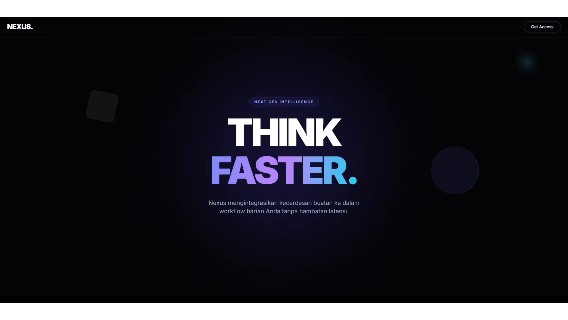
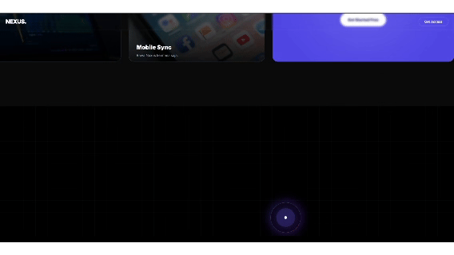
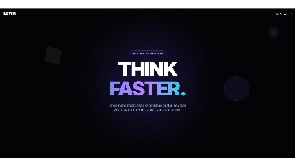

# **Masterclass UI/UX: Membangun Landing Page SaaS 'NEXUS' dengan Animasi GSAP & Tailwind CSS**


Dalam tutorial ini, kita akan melampaui sekadar membuat halaman web statis. Kita akan membangun **NEXUS**, sebuah landing page untuk produk AI fiktif yang menggabungkan empat teknik animasi web modern paling populer saat ini:

1. **Mouse Parallax** (Hero Section yang responsif).
2. **Bento Grid Reveal** (Layout grid asimetris dengan animasi berurutan).
3. **Horizontal Scroll** (Galeri geser samping).
4. **Pinned Process Timeline** (Animasi bercerita yang dikontrol oleh scroll).

Kita hanya menggunakan **HTML**, **Tailwind CSS** (via CDN untuk styling cepat), dan **GSAP** (untuk engine animasi).

---

## Langkah 1: Struktur Hero & Mouse Parallax



Bagian pertama adalah membuat kesan pertama yang kuat. Kita ingin elemen latar belakang bergerak halus merespons gerakan mouse pengguna, menciptakan efek kedalaman (3D).

Siapkan file dengan nama index.html dan buat kode untuk Langkah 1

`index.html`

```html
<!DOCTYPE html>
<html lang="id">
  <head>
    <meta charset="UTF-8" />
    <meta name="viewport" content="width=device-width, initial-scale=1.0" />
    <title>NEXUS - AI Generation Landing Page</title>

    <!-- Load Tailwind CSS -->
    <script src="https://cdn.tailwindcss.com"></script>

    <style>
      @import url("https://fonts.googleapis.com/css2?family=Inter:wght@300;400;600;900&display=swap");

      body {
        font-family: "Inter", sans-serif;
      }

      /* Hide Scrollbar */
      ::-webkit-scrollbar {
        width: 0px;
        background: transparent;
      }

      /* Custom Noise Texture Class */
      .bg-noise {
        background-image: url("data:image/svg+xml,%3Csvg viewBox='0 0 200 200' xmlns='http://www.w3.org/2000/svg'%3E%3Cfilter id='noiseFilter'%3E%3CfeTurbulence type='fractalNoise' baseFrequency='0.65' numOctaves='3' stitchTiles='stitch'/%3E%3C/filter%3E%3Crect width='100%25' height='100%25' filter='url(%23noiseFilter)' opacity='0.05'/%3E%3C/svg%3E");
      }
    </style>
  </head>

  <body
    class="bg-[#050507] text-white overflow-x-hidden selection:bg-indigo-500/30"
  >
    <!-- LANGKAH 1: NAVIGATION & HERO (Mouse Parallax) -->
    <!-- ================================================================= -->

    <nav
      class="fixed top-0 w-full z-50 px-6 py-4 flex justify-between items-center backdrop-blur-sm border-b border-white/5"
    >
      <div class="text-2xl font-bold tracking-tighter text-white">NEXUS.</div>
      <button
        class="px-6 py-2 border border-white/20 rounded-full text-sm font-medium hover:bg-white hover:text-black transition-all duration-300"
      >
        Get Access
      </button>
    </nav>

    <header
      class="relative h-screen flex flex-col items-center justify-center overflow-hidden"
    >
      <!-- Background Glow -->
      <div
        class="absolute top-1/2 left-1/2 -translate-x-1/2 -translate-y-1/2 w-[600px] h-[600px] bg-indigo-600/20 rounded-full blur-[120px] pointer-events-none"
      ></div>

      <!-- Elemen Parallax (Bergerak mengikuti mouse) -->
      <div
        data-speed="20"
        class="parallax-item absolute top-1/4 left-[15%] w-24 h-24 rounded-2xl border border-white/10 bg-white/5 backdrop-blur-md rotate-12 z-0"
      ></div>
      <div
        data-speed="-30"
        class="parallax-item absolute bottom-1/3 right-[15%] w-40 h-40 rounded-full border border-white/10 bg-indigo-500/10 backdrop-blur-md z-0"
      ></div>
      <div
        data-speed="10"
        class="parallax-item absolute top-32 right-32 w-8 h-8 rounded-full bg-cyan-400/40 blur-lg z-0"
      ></div>

      <!-- Konten Teks Utama -->
      <div class="relative z-10 text-center px-4 max-w-4xl mx-auto">
        <div
          class="inline-block mb-6 px-4 py-1.5 border border-indigo-500/30 rounded-full bg-indigo-900/20 text-indigo-300 text-xs font-semibold tracking-[0.2em] uppercase"
        >
          Next Gen Intelligence
        </div>
        <h1
          class="text-7xl md:text-9xl font-black tracking-tighter leading-[0.9] mb-8"
        >
          THINK <br />
          <span
            class="text-transparent bg-clip-text bg-gradient-to-r from-indigo-400 via-purple-400 to-cyan-400 animate-gradient"
            >FASTER.</span
          >
        </h1>
        <p
          class="max-w-lg mx-auto text-slate-400 text-lg md:text-xl leading-relaxed"
        >
          Nexus mengintegrasikan kecerdasan buatan ke dalam workflow harian Anda
          tanpa hambatan latensi.
        </p>
      </div>
    </header>

    <!-- FOOTER -->
    <footer class="py-20 bg-[#050507] text-center border-t border-white/5">
      <div class="text-2xl font-bold text-white mb-4">NEXUS.</div>
      <p class="text-slate-500 text-sm mb-8">
        &copy; 2025 Nexus Inc. All rights reserved.
      </p>
      <div class="flex justify-center gap-6 text-slate-400 text-sm">
        <a href="#" class="hover:text-white transition-colors">Privacy</a>
        <a href="#" class="hover:text-white transition-colors">Terms</a>
        <a href="#" class="hover:text-white transition-colors">Twitter</a>
      </div>
    </footer>

    <!-- LOGIC SCRIPTS -->
    <!-- ================================================================= -->
    <script src="https://cdnjs.cloudflare.com/ajax/libs/gsap/3.12.2/gsap.min.js"></script>
    <script src="https://cdnjs.cloudflare.com/ajax/libs/gsap/3.12.2/ScrollTrigger.min.js"></script>

    <script>
      gsap.registerPlugin(ScrollTrigger);

      // --- LOGIC 1: MOUSE PARALLAX (HERO) ---
      document.addEventListener("mousemove", (e) => {
        const x = (e.clientX / window.innerWidth - 0.5) * 2;
        const y = (e.clientY / window.innerHeight - 0.5) * 2;

        document.querySelectorAll(".parallax-item").forEach((item) => {
          const speed = item.getAttribute("data-speed");
          gsap.to(item, {
            x: x * speed,
            y: y * speed,
            duration: 1,
            ease: "power2.out",
          });
        });
      });
    </script>
  </body>
</html>
```

**Penjelasan:**

- Kita menggunakan event listener **`mousemove`**.
- Posisi kursor dihitung dari tengah layar (nilai -1 hingga 1).
- GSAP menggerakkan elemen **`.parallax-item`** berdasarkan atribut **`data-speed`**. Semakin besar angkanya, semakin cepat gerakannya.

**Poin Visual:**

- Menggunakan efek *Glassmorphism* (blur) dan *Glow* ungu besar di tengah untuk nuansa futuristik.
- Tipografi raksasa dengan gradient text (**`bg-clip-text`**) agar terlihat modern.

---

## Langkah 2: The "Bento Grid" Layout


Tren desain 2025 didominasi oleh layout kotak-kotak modular (seperti kotak bekal Bento Jepang). Tantangannya adalah membuatnya tidak membosankan.

Lanjutkan kode dengan menambahkan kode ini di bawah tag `</header>`

update file `index.html`

```html
<!-- LANGKAH 2: BENTO GRID SECTION (Stagger Reveal) -->
<!-- ================================================================= -->

<section class="py-32 px-6 md:px-20 bg-[#050507] relative z-10">
  <div class="max-w-7xl mx-auto">
    <div class="text-center mb-20">
      <h2 class="text-3xl md:text-5xl font-bold">
        Designed for <span class="text-indigo-400">Velocity</span>
      </h2>
      <p class="text-slate-500 mt-4">
        Semua alat yang Anda butuhkan dalam satu grid.
      </p>
    </div>

    <!-- Grid Layout -->
    <div class="grid grid-cols-1 md:grid-cols-3 gap-6 auto-rows-[320px]">
      <!-- Card 1: Neural Engine (Lebar 2 Kolom) -->
      <div
        class="bento-card md:col-span-2 bg-slate-900/40 border border-white/10 rounded-3xl p-8 relative overflow-hidden group hover:border-indigo-500/30 transition-colors duration-500 flex flex-col justify-between"
      >
        <div
          class="absolute inset-0 bg-gradient-to-br from-indigo-600/10 to-transparent opacity-0 group-hover:opacity-100 transition-opacity duration-500"
        ></div>
        <div class="relative z-10">
          <h3 class="text-2xl font-bold mb-2 text-white">Neural Engine</h3>
          <p class="text-slate-400">
            Pemrosesan data real-time dengan latensi mendekati nol.
          </p>
        </div>
        <!-- Grafik Abstrak SVG -->
        <div
          class="relative w-full h-32 mt-4 border border-white/5 rounded-xl bg-slate-950/50 overflow-hidden flex items-center justify-center"
        >
          <svg
            class="w-full h-20 text-indigo-500"
            viewBox="0 0 400 100"
            preserveAspectRatio="none"
          >
            <path
              d="M0,50 Q50,20 100,50 T200,50 T300,50 T400,50"
              fill="none"
              stroke="currentColor"
              stroke-width="2"
              class="opacity-50"
            >
              <animate
                attributeName="d"
                dur="5s"
                repeatCount="indefinite"
                values="M0,50 Q50,20 100,50 T200,50 T300,50 T400,50; M0,50 Q50,80 100,50 T200,20 T300,80 T400,50; M0,50 Q50,20 100,50 T200,50 T300,50 T400,50"
              />
            </path>
            <path
              d="M0,50 Q50,80 100,50 T200,20 T300,80 T400,50"
              fill="none"
              stroke="cyan"
              stroke-width="2"
            >
              <animate
                attributeName="d"
                dur="5s"
                repeatCount="indefinite"
                values="M0,50 Q50,80 100,50 T200,20 T300,80 T400,50; M0,50 Q50,20 100,50 T200,50 T300,50 T400,50; M0,50 Q50,80 100,50 T200,20 T300,80 T400,50"
              />
            </path>
          </svg>
          <div
            class="absolute inset-0 bg-[linear-gradient(to_right,#ffffff05_1px,transparent_1px),linear-gradient(to_bottom,#ffffff05_1px,transparent_1px)] bg-[size:20px_20px]"
          ></div>
        </div>
      </div>

      <!-- Card 2: Secure -->
      <div
        class="bento-card bg-slate-900/40 border border-white/10 rounded-3xl p-8 relative group overflow-hidden hover:border-cyan-500/30 transition-colors duration-500 flex flex-col justify-between"
      >
        <div
          class="absolute -right-12 -top-12 w-40 h-40 bg-cyan-500/20 blur-[50px] group-hover:bg-cyan-500/30 transition-all duration-500"
        ></div>
        <div class="w-full flex-1 flex items-center justify-center">
          <svg
            class="w-20 h-20 text-cyan-500/80 drop-shadow-[0_0_15px_rgba(6,182,212,0.5)]"
            fill="none"
            stroke="currentColor"
            viewBox="0 0 24 24"
          >
            <path
              stroke-linecap="round"
              stroke-linejoin="round"
              stroke-width="1.5"
              d="M12 15v2m-6 4h12a2 2 0 002-2v-6a2 2 0 00-2-2H6a2 2 0 00-2 2v6a2 2 0 002 2zm10-10V7a4 4 0 00-8 0v4h8z"
            ></path>
          </svg>
        </div>
        <div class="relative z-10">
          <h3 class="text-2xl font-bold mb-1 text-white">Secure</h3>
          <p class="text-slate-400 text-sm">
            Enkripsi End-to-End standar militer.
          </p>
        </div>
      </div>

      <!-- Card 3: Integration (Tinggi 2 Baris) -->
      <div
        class="bento-card md:row-span-2 bg-slate-900/40 border border-white/10 rounded-3xl p-0 relative overflow-hidden group hover:border-white/20 transition-colors duration-500"
      >
        <div class="absolute inset-0 bg-noise z-0"></div>
        <div
          class="absolute inset-0 bg-gradient-to-b from-transparent via-black/50 to-black z-10"
        ></div>
        
        <div class="absolute bottom-0 left-0 w-full p-8 z-20">
          <h3 class="text-3xl font-bold mb-2 text-white">Integration</h3>
          <p class="text-slate-300 mb-6">
            Terhubung dengan 50+ aplikasi favorit Anda dalam satu klik.
          </p>
          <button
            class="text-sm font-semibold text-white border-b border-white pb-1 hover:text-indigo-300 hover:border-indigo-300 transition-colors"
          >
            View Integrations &rarr;
          </button>
        </div>
      </div>

      <!-- Card 4: API -->
      <div
        class="bento-card bg-slate-900/40 border border-white/10 rounded-3xl p-8 flex flex-col items-center justify-center group hover:border-purple-500/30 transition-colors duration-500 relative overflow-hidden"
      >
        <div
          class="absolute inset-0 opacity-10 font-mono text-[10px] p-4 leading-tight text-purple-300 overflow-hidden select-none"
        >
          function init() { return api.connect(); } const data = await
          fetch('/v1'); class Nexus extends API { constructor() { super(); } }
        </div>
        <div class="text-center relative z-10">
          <div
            class="text-6xl font-black text-white/20 group-hover:text-white transition-colors duration-500"
          >
            API
          </div>
          <p class="text-slate-500 mt-2 text-sm font-mono">REST & GraphQL</p>
        </div>
      </div>

      <!-- Card 5: Global Scale -->
      <div
        class="bento-card bg-slate-900/40 border border-white/10 rounded-3xl p-8 flex flex-col justify-between group hover:border-emerald-500/30 transition-colors duration-500 relative overflow-hidden"
      >
        <div
          class="absolute inset-0 opacity-20"
          style="
                background-image: radial-gradient(#10b981 1px, transparent 1px);
                background-size: 20px 20px;
              "
        ></div>
        <div class="relative z-10">
          <div
            class="w-12 h-12 bg-emerald-500/20 rounded-full mb-4 flex items-center justify-center text-emerald-400"
          >
            <svg
              class="w-6 h-6"
              fill="none"
              stroke="currentColor"
              viewBox="0 0 24 24"
            >
              <path
                stroke-linecap="round"
                stroke-linejoin="round"
                stroke-width="2"
                d="M3.055 11H5a2 2 0 012 2v1a2 2 0 002 2 2 2 0 012 2v2.945M8 3.935V5.5A2.5 2.5 0 0010.5 8h.5a2 2 0 012 2 2 2 0 104 0 2 2 0 012-2h1.064M15 20.488V18a2 2 0 012-2h3.064M21 12a9 9 0 11-18 0 9 9 0 0118 0z"
              ></path>
            </svg>
          </div>
          <h3 class="text-2xl font-bold mb-1 text-white">Global Scale</h3>
          <p class="text-slate-400 text-sm">Deployed to 24 regions.</p>
        </div>
        <!-- Server Status -->
        <div
          class="flex items-center gap-3 mt-4 bg-slate-950/50 p-3 rounded-xl border border-white/5"
        >
          <span class="relative flex h-3 w-3">
            <span
              class="animate-ping absolute inline-flex h-full w-full rounded-full bg-emerald-400 opacity-75"
            ></span>
            <span
              class="relative inline-flex rounded-full h-3 w-3 bg-emerald-500"
            ></span>
          </span>
          <span class="text-xs font-mono text-emerald-400"
            >ALL SYSTEMS OPERATIONAL</span
          >
        </div>
      </div>
    </div>
  </div>
</section>
```

```html
<!-- Card 6: Call to Action (Span 2) -->
          <div
            class="bento-card md:col-span-2 bg-indigo-600 border border-indigo-500 rounded-3xl p-8 md:p-12 flex flex-col md:flex-row items-center justify-between relative overflow-hidden group hover:bg-indigo-500 transition-colors duration-500"
          >
            <div class="relative z-10 max-w-md">
              <h3 class="text-3xl md:text-4xl font-bold mb-4 text-white">
                Start Building Today
              </h3>
              <p class="text-indigo-100 text-lg">
                Dapatkan akses awal ke platform Nexus.
              </p>
            </div>
            <button
              class="relative z-10 mt-6 md:mt-0 px-8 py-4 bg-white text-indigo-900 font-bold rounded-full hover:shadow-lg hover:scale-105 transition-all duration-300"
            >
              Create Account
            </button>
            <div
              class="absolute -bottom-32 -right-32 w-96 h-96 bg-white/20 rounded-full blur-[80px] pointer-events-none"
            ></div>
          </div>
        </div>
      </div>
    </section>
```

Letakkan kode script ini di bawah LOGIC 1

```jsx
// --- LOGIC 2: BENTO GRID REVEAL (STAGGER) ---
gsap.set(".bento-card", { opacity: 0, y: 100 });

ScrollTrigger.batch(".bento-card", {
  start: "top 85%",
  onEnter: (batch) =>
    gsap.to(batch, {
      opacity: 1,
      y: 0,
      stagger: 0.1,
      duration: 1,
      ease: "power4.out",
    }),
});
```

**Penjelasan:**

- **Grid System:** Menggunakan **`grid-cols-1 md:grid-cols-3`** dari Tailwind.
- **Visual Filling:**
  - *Neural Engine:* Menggunakan SVG Graph yang dianimasikan dengan SMIL (tag **`<animate>`**) agar terlihat hidup.
  - *Secure:* Menggunakan ikon gembok besar dengan efek neon (drop-shadow).
  - *Global Scale:* Menambahkan peta titik-titik (radial gradient) dan indikator "ping" berdenyut untuk kesan live server status.
- **Animasi GSAP:** Kita menggunakan **`ScrollTrigger.batch`**. Ini secara otomatis mendeteksi saat baris kartu masuk ke layar dan memunculkannya satu per satu (_stagger_) dengan efek melontar (_back.out_).

---

## Langkah 3: Showcase dengan Horizontal Scroll


Bagaimana menampilkan banyak gambar produk tanpa membuat halaman menjadi sangat panjang ke bawah? Jawabannya: Scroll Samping.

Tambahkan kode ini di `index.html` di bawah tag `</section>` Langkah 2

```html
<!-- LANGKAH 3: HORIZONTAL SCROLL SHOWCASE (Pinned) -->
<!-- ================================================================= -->

<section
  id="showcase"
  class="h-screen bg-[#0a0a0a] text-white overflow-hidden flex flex-col justify-center relative z-20 border-t border-white/10"
>
  <div class="absolute top-10 left-6 md:left-20 flex items-center gap-4">
    <div class="w-12 h-[1px] bg-indigo-500"></div>
    <div class="text-sm font-mono tracking-widest uppercase text-indigo-400">
      Nexus Interface
    </div>
  </div>

  <!-- Container Horizontal -->
  <div
    id="h-container"
    class="flex gap-8 pl-6 md:pl-20 pr-20 items-center h-full"
  >
    <!-- Card 1: Dashboard -->
    <div
      class="group relative h-[60vh] w-[85vw] md:w-[60vw] rounded-3xl flex-shrink-0 overflow-hidden border border-white/10 bg-slate-900 transition-transform hover:scale-[1.01] duration-500"
    >
      <!-- Image: Dashboard UI (Dark Mode Analytics) -->
      
      <div
        class="absolute inset-0 bg-gradient-to-t from-black/90 via-black/40 to-transparent"
      ></div>
      <div
        class="absolute bottom-0 left-0 w-full p-10 translate-y-4 group-hover:translate-y-0 transition-transform duration-500"
      >
        <div
          class="inline-block px-3 py-1 mb-3 rounded-full bg-indigo-500/20 border border-indigo-500/30 text-xs text-indigo-300 font-mono"
        >
          v2.0
        </div>
        <h3 class="text-3xl md:text-4xl font-bold mb-2">Command Center</h3>
        <p class="text-slate-400 max-w-md">
          Monitor semua aktivitas AI, penggunaan token, dan analitik performa
          dalam satu tampilan real-time.
        </p>
      </div>
    </div>

    <!-- Card 2: Code Editor -->
    <div
      class="group relative h-[60vh] w-[85vw] md:w-[60vw] rounded-3xl flex-shrink-0 overflow-hidden border border-white/10 bg-slate-900 transition-transform hover:scale-[1.01] duration-500"
    >
      <!-- Image: Code/Programming Screen -->
      
      <div
        class="absolute inset-0 bg-gradient-to-t from-black/90 via-black/40 to-transparent"
      ></div>
      <div
        class="absolute bottom-0 left-0 w-full p-10 translate-y-4 group-hover:translate-y-0 transition-transform duration-500"
      >
        <div
          class="inline-block px-3 py-1 mb-3 rounded-full bg-cyan-500/20 border border-cyan-500/30 text-xs text-cyan-300 font-mono"
        >
          DEV MODE
        </div>
        <h3 class="text-3xl md:text-4xl font-bold mb-2">Smart Editor</h3>
        <p class="text-slate-400 max-w-md">
          Debugging otomatis dan saran kode cerdas yang memahami konteks proyek
          Anda sepenuhnya.
        </p>
      </div>
    </div>

    <!-- Card 3: Mobile App -->
    <div
      class="group relative h-[60vh] w-[85vw] md:w-[30vw] rounded-3xl flex-shrink-0 overflow-hidden border border-white/10 bg-slate-900 transition-transform hover:scale-[1.01] duration-500"
    >
      <!-- Image: Mobile App Interface -->
      
      <div
        class="absolute inset-0 bg-gradient-to-t from-black/90 via-black/40 to-transparent"
      ></div>
      <div
        class="absolute bottom-0 left-0 w-full p-8 translate-y-4 group-hover:translate-y-0 transition-transform duration-500"
      >
        <h3 class="text-2xl font-bold mb-2">Mobile Sync</h3>
        <p class="text-slate-400 text-sm">Bawa Nexus ke mana saja.</p>
      </div>
    </div>

    <!-- Card 4: CTA End -->
    <div
      class="h-[60vh] w-[85vw] md:w-[40vw] flex flex-col items-center justify-center rounded-3xl flex-shrink-0 border border-white/10 bg-indigo-600 relative overflow-hidden group"
    >
      <div
        class="absolute top-1/2 left-1/2 -translate-x-1/2 -translate-y-1/2 w-[500px] h-[500px] bg-white/10 rounded-full blur-[100px] group-hover:bg-white/20 transition-colors duration-700"
      ></div>
      <div class="relative z-10 text-center px-6">
        <h2 class="text-5xl md:text-7xl font-black mb-6 tracking-tighter">
          READY?
        </h2>
        <p class="text-indigo-100 mb-8 max-w-xs mx-auto text-lg">
          Bergabung dengan 10.000+ developer yang telah beralih ke Nexus.
        </p>
        <button
          class="px-8 py-4 bg-white text-indigo-900 font-bold rounded-full hover:scale-110 hover:shadow-[0_0_40px_rgba(255,255,255,0.3)] transition-all duration-300"
        >
          Get Started Free
        </button>
      </div>
    </div>
  </div>
</section>
```

Letakkan script ini di bawah kode LOGIC 2

```jsx
// --- LOGIC 3: HORIZONTAL SCROLL ---
      const hContainer = document.getElementById("h-container");
      const showcaseSection = document.getElementById("showcase");

      function getScrollAmount() {
        let containerWidth = hContainer.scrollWidth;
        return -(containerWidth - window.innerWidth);
      }

      const tween = gsap.to(hContainer, {
        x: getScrollAmount,
        ease: "none",
      });

      ScrollTrigger.create({
```

**Penjelasan:**

1. Kita membungkus galeri dalam container **`h-screen`** (tinggi penuh layar).
2. Menggunakan **`ScrollTrigger`** dengan properti **`pin: true`**. Ini akan "memaku" section tersebut agar tidak bergerak vertikal.
3. Saat pengguna scroll ke bawah, GSAP mengubah gerakan vertikal tersebut menjadi translasi horizontal (**`x axis`**) pada container gambar.
4. **Update Visual:** Kita mengganti kotak abu-abu dengan *mockup UI* bergaya gelap (Dashboard, Code Editor) dan menambahkan overlay gradient agar teks selalu terbaca.

---

## Langkah 4: Architecture Section (Pinned Timeline)



Ini adalah fitur mewah yang membuat situs terasa premium. Kita ingin menjelaskan proses teknis (Langkah 1 -> 2 -> 3) di satu tempat tanpa pengguna kehilangan fokus.

Tambahkan kode ini di bawah tag `</section>` langkah 3

```html
<!-- LANGKAH 4: PROCESS ARCHITECTURE (Pinned Sequence Timeline) -->
<!-- ================================================================= -->

<section
  id="process-section"
  class="h-screen bg-black text-white relative overflow-hidden flex items-center justify-center"
>
  <!-- Grid Background -->
  <div
    class="absolute inset-0 bg-[linear-gradient(rgba(255,255,255,0.03)_1px,transparent_1px),linear-gradient(90deg,rgba(255,255,255,0.03)_1px,transparent_1px)] bg-[size:50px_50px]"
  ></div>

  <div
    class="relative w-full max-w-6xl px-6 md:px-20 flex flex-col md:flex-row items-center justify-between h-full"
  >
    <!-- Left: Text Steps Container -->
    <div class="w-full md:w-1/2 relative h-[300px] flex items-center">
      <!-- Step 1 -->
      <div class="process-step absolute opacity-0 translate-y-10" id="step1">
        <div class="text-indigo-500 font-mono text-sm mb-2 tracking-widest">
          STEP 01
        </div>
        <h3 class="text-4xl md:text-6xl font-bold mb-4">Data Ingestion</h3>
        <p class="text-slate-400 text-lg">
          Nexus menyerap data dari berbagai sumber secara simultan tanpa
          bottleneck.
        </p>
      </div>
      <!-- Step 2 -->
      <div class="process-step absolute opacity-0 translate-y-10" id="step2">
        <div class="text-cyan-500 font-mono text-sm mb-2 tracking-widest">
          STEP 02
        </div>
        <h3 class="text-4xl md:text-6xl font-bold mb-4">Neural Processing</h3>
        <p class="text-slate-400 text-lg">
          Model AI kami memecah kompleksitas data menjadi insight yang dapat
          ditindaklanjuti.
        </p>
      </div>
      <!-- Step 3 -->
      <div class="process-step absolute opacity-0 translate-y-10" id="step3">
        <div class="text-emerald-500 font-mono text-sm mb-2 tracking-widest">
          STEP 03
        </div>
        <h3 class="text-4xl md:text-6xl font-bold mb-4">Execution</h3>
        <p class="text-slate-400 text-lg">
          Hasil dikirim kembali ke aplikasi Anda dalam milidetik.
        </p>
      </div>
    </div>

    <!-- Right: Visual Core Animation -->
    <div
      class="w-full md:w-1/2 flex justify-center items-center relative h-[400px]"
    >
      <!-- Core Circle -->
      <div
        id="core-circle"
        class="w-32 h-32 rounded-full bg-gradient-to-br from-indigo-600 to-purple-600 blur-xl absolute z-0 opacity-50"
      ></div>
      <div
        class="w-32 h-32 rounded-full border border-white/20 bg-black/50 backdrop-blur-sm relative z-10 flex items-center justify-center"
      >
        <div
          class="w-20 h-20 rounded-full bg-indigo-500/20 flex items-center justify-center animate-pulse"
        >
          <div class="w-3 h-3 bg-white rounded-full"></div>
        </div>
      </div>

      <!-- Orbiting Elements -->
      <div class="absolute inset-0" id="orbits">
        <div
          class="absolute top-1/2 left-1/2 -translate-x-1/2 -translate-y-1/2 w-[300px] h-[300px] border border-indigo-500/30 rounded-full scale-0 opacity-0 orbit-ring"
        ></div>
        <div
          class="absolute top-1/2 left-1/2 -translate-x-1/2 -translate-y-1/2 w-[450px] h-[450px] border border-cyan-500/30 rounded-full scale-0 opacity-0 orbit-ring"
        ></div>
        <div
          class="particle absolute top-1/2 left-1/2 w-2 h-2 bg-indigo-400 rounded-full opacity-0"
        ></div>
        <div
          class="particle absolute top-1/2 left-1/2 w-2 h-2 bg-cyan-400 rounded-full opacity-0"
        ></div>
        <div
          class="particle absolute top-1/2 left-1/2 w-2 h-2 bg-emerald-400 rounded-full opacity-0"
        ></div>
      </div>
    </div>
  </div>
</section>
```

Tambahkan script ini di bawah LOGIC 3

```jsx
// --- LOGIC 4: PINNED SEQUENCE TIMELINE ---
const processSection = document.getElementById("process-section");
const rings = document.querySelectorAll(".orbit-ring");
const particles = document.querySelectorAll(".particle");

const tlProcess = gsap.timeline({
  scrollTrigger: {
    trigger: processSection,
    start: "top top",
    end: "+=3000",
    pin: true,
    scrub: 1,
    anticipatePin: 1,
  },
});

tlProcess
  // Step 1: Masuk
  .to("#step1", { opacity: 1, y: 0, duration: 1 })
  .to(rings[0], { scale: 1, opacity: 1, duration: 1 }, "<")
  .to(particles[0], { opacity: 1, x: 150, duration: 1 }, "<")
  // Step 1: Keluar
  .to("#step1", { opacity: 0, y: -20, duration: 1, delay: 1 })

  // Step 2: Masuk
  .to("#step2", { opacity: 1, y: 0, duration: 1 })
  .to(rings[1], { scale: 1, opacity: 1, duration: 1 }, "<")
  .to(
    "#core-circle",
    { backgroundColor: "#06b6d4", scale: 1.5, duration: 1 },
    "<"
  )
  .to(particles[1], { opacity: 1, x: -225, duration: 1 }, "<")
  // Step 2: Keluar
  .to("#step2", { opacity: 0, y: -20, duration: 1, delay: 1 })

  // Step 3: Masuk
  .to("#step3", { opacity: 1, y: 0, duration: 1 })
  .to(rings, { scale: 0.5, opacity: 0, duration: 1 }, "<")
  .to(
    "#core-circle",
    { backgroundColor: "#10b981", scale: 2, opacity: 0.8, duration: 1 },
    "<"
  )
  .to(particles, { x: 0, opacity: 0, duration: 0.5 }, "<")
  .to({}, { duration: 1 }); // Hold di akhir
```

**Penjelasan:**

- **Pinning:** Section **`#process-section`** ditahan (pinned) selama durasi scroll setara 3x tinggi layar.
- **Timeline Scrubbing:** Animasi terikat 100% dengan posisi scrollbar (bukan durasi waktu). Jika user berhenti scroll, animasi berhenti.
- **Timeline:**
  1. *Langkah 1:* Teks masuk, cincin orbit muncul.
  2. *Langkah 2:* Teks 1 hilang, Teks 2 masuk, Inti (Core) berubah warna jadi Cyan.
  3. *Langkah 3:* Teks 2 hilang, Teks 3 masuk, Cincin menyusut (implode) ke tengah, Inti berubah Hijau.

Teknik ini sangat efektif untuk *storytelling* produk yang kompleks.

---

## Kesimpulan & Kode Final



Dengan menggabungkan keempat teknik di atas, kita telah mengubah halaman informasi biasa menjadi sebuah pengalaman (_experience_). Pengguna tidak hanya membaca, tetapi "bermain" dengan scroll mereka untuk menyingkap konten.

Simpan kode berikut sebagai **`index.html`** untuk melihat hasil akhirnya.

Selamat! Semoga dari tutorial ini kalian bisa memahami secara mendalam tentang membuat Landing Page dengan GSAP.
